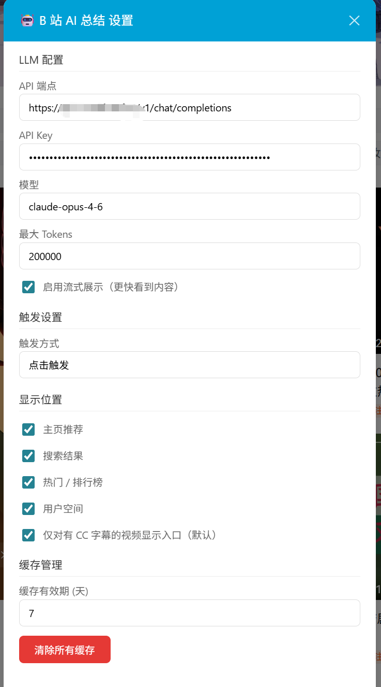

# B站先知

> 看视频前先知道值不值得看。AI 自动分析字幕，主页封面直出评级 + 概述 + 关键点，进度条标注时间轴。

 

## 预览

## 功能

### 主页智能预览
- 后台自动分析主页、搜索页、排行榜、UP主空间的视频
- 封面直接显示**评级**（值得看 / 一般 / 不值得看）、概述、关键点、时间节点
- 鼠标移开后评级徽章保留在封面左上角
- 深度渐变 + 双层文字阴影，任何封面颜色下都清晰可读

### 一键复制
- 悬停封面显示 AI 总结
- 「复制」按钮将评级 + 概述 + 关键点一键写入剪贴板
- 章节标签可点击，直接跳转到对应时间点

### 进度条时间轴
- 视频详情页进度条上自动标注 AI 分析出的关键时间节点
- 蓝色竖线 + 标签 + 箭头，始终显示
- 点击标签直接跳转，支持 SPA 路由

### 缓存与配置
- IndexedDB 本地缓存，默认 7 天有效期
- 自定义 LLM 接口（endpoint / API Key / 模型）
- 油猴菜单 → ⚙️ 设置面板

## 安装

1. 安装 [Tampermonkey](https://www.tampermonkey.net/)
2. 点击 [安装脚本](https://greasyfork.org) *(即将上线)*
3. 打开设置面板，填入 LLM API 地址和 Key
4. 回到 B站主页，等待封面出现评级标记

## 要求

- Tampermonkey（Chrome / Edge / Firefox）
- OpenAI 兼容格式的 LLM API（支持流式输出）
- 视频需有 CC 字幕

## 配置项

| 配置 | 说明 | 默认值 |
|------|------|--------|
| LLM Endpoint | API 地址 | - |
| API Key | 密钥 | - |
| 模型 | 模型名称 | - |
| 触发方式 | 悬停延迟 | 800ms |
| 自动预加载 | 并发数 | 2 |
| 缓存有效期 | 天数 | 7天 |

## License

MIT
